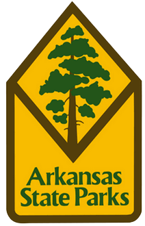

# Arkansas State Parks GIS Web App with C# ASP.NET CORE MVC and Leaflet

Welcome to my Arkansas State Parks GIS Web App project, a comprehensive full-stack MVC web application developed using C# ASP.NET CORE and Leaflet.js. This project aims to leverage the power of geospatial analytics and convert it into a functional web application for exploring Arkansas State Parks data. I use PostgreSQL and PostGIS to create a Spacial Database in pgAdmin4, Integrated interactive charts using Chart.js and a robust web map using Leaflet.js. Constructed Rest API Endpoints in C# with LINQ. And Finally built the web app front end in CSS and JS for a pleasing and responsive App.

## Project Overview

In this project, we are working with Arkansas State Parks data (however average monthly visitor data is fabricated for demonstration purposes as I could not find any resources to work with and went with a combonation of random and guesstimated data from my own experiences) and implementing data processing techniques to extract, transform, and load this data into our spatial database. Once the data is processed and cleaned, it serves as the foundation for our .NET Core Web Map Application.

## Preview
https://github.com/Winphillips/AR-StateParks-GIS-App/assets/98627220/2567d20f-cd00-48f2-805b-f66e8ece8b1c

## Technologies Used

- **Back-End**: C#, ASP.NET CORE - MVC, Entity Framework Core, Newtonsoft.Json, Npgsql
- **Front-End**: HTML, CSS - Bootstrap, JavaScript, Leaflet, Ajax
- **Database**: PostgreSQL and PostGIS

## What I Learned
- Create a full-stack web GIS application from scratch.
- Develop full-stack ASP.NET Core MVC applications.
- Write backend code in C# for data processing and manipulation.
- Integrate third-party JavaScript charting libraries to visualize data.
- Build and maintain a .NET Core REST API.
- Harness the capabilities of PostgreSQL for .NET and Windows environments.
- Utilize Entity Framework Core for efficient data management.

## Getting Started

To get started with this project, please follow the installation and setup instructions detailed in the project's documentation. You'll find step-by-step guidance on configuring your development environment, setting up the database, and launching the web application.

**Disclaimer**: This project uses fabricated data for demonstration purposes, and any reference to actual Arkansas State Parks data is purely coincidental.
